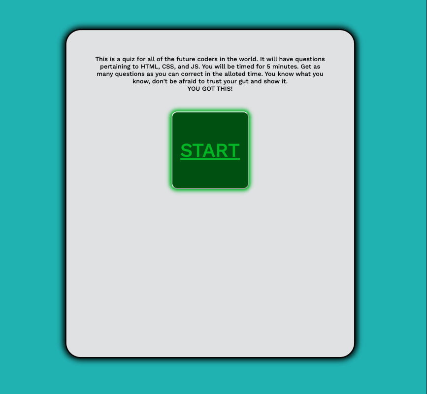

# Delightfully-Distinct-Quizing-Game

## Description:
For this assingnment, I created a quiz using my knowledge of JS. The interactive quiz takes the user input and keeps track of their score. This is then stored in local storage and a a highscore list is created. This project uses HMTL, CSS, and JS to function. This is a quiz that will continue to updated as we progress througout the UC Berekeley bootcamp. 

## Credits: 

This website was created by Bryce Lingle. If you have questions or comments, please feel free to reach out to me at brycealingle@gmail.com. In order to complete this assingment, I accessed Michael Seaman, a TA at UC Berkeley and the Slack Ask-BCS resource in order to complete this task. 

## Image: 

## Link:

# Come see my page! https://bryce-lingle.github.io/Delightfully-Distinct-Quizing-Game/

# GitHub Repository: https://github.com/Bryce-Lingle/Delightfully-Distinct-Quizing-Game